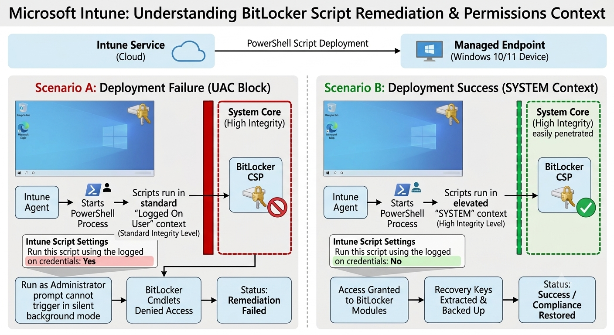

# Intune-BitLocker-Remediation
Fix for Intune BitLocker remediation script failures caused by user privilege and UAC constraints.


# Microsoft Intune: Resolving BitLocker Script Remediation Failures (UAC Block)

## 📌 Problem Overview
When deploying PowerShell scripts via Microsoft Intune to remediate BitLocker encryption or back up recovery keys on endpoints, deployments can encounter widespread failures. For example, initial dashboard metrics can show massive execution errors across a targeted fleet.

Although endpoints have physical encryption active, the remediation script repeatedly fails to execute or fetch critical BitLocker metadata.

---

## 💻 Deployed PowerShell Code
The following automated scripts are executed sequentially on the target endpoints to fetch active BitLocker key protectors and securely escalate them to Azure Active Directory (AAD):

```powershell
# Step 1: Identify and target the unique ID of the Recovery Password key protector
$KeyPair = (Get-BitLockerVolume -MountPoint "C:").KeyProtector | Where-Object {$_.KeyProtectorType -eq 'RecoveryPassword'}

# Step 2: Push the identified BitLocker recovery key into Entra ID / Azure AD
BackupToAAD-BitLockerKeyProtector -MountPoint "C:" -KeyProtectorId $KeyPair.KeyProtectorId
```
---


## 🔍 Backend Process & Permissions Context Diagram

The backend architecture diagram below clarifies how Intune interacts with the Windows subsystem and why the permission context makes or breaks this specific deployment.



### 📋 Detailed Diagram Explanation

The diagram splits the deployment behavior into two distinct tracks to show the direct correlation between your Intune script settings and the endpoint's operating system behavior:

#### **Scenario A: Deployment Failure (UAC Block)**
* **The Configuration:** This track represents the environment when **"Run this script using the logged on credentials"** is set to **Yes**.
* **The Security Barrier:** Even if the targeted end-user has local administrator rights, Windows launches background Intune scripts inside a non-elevated user token (Standard Integrity Level).
* **The Silent Block:** Because the script executes silently in the background, it cannot trigger a visible User Account Control (UAC) prompt ("Run as Administrator"). As a result, the script is denied access when attempting to query the high-integrity **BitLocker Configuration Service Provider (CSP)** layer, ending in a "Remediation Failed" error.

#### **Scenario B: Deployment Success (SYSTEM Context)**
* **The Configuration:** This track represents the optimal setup where **"Run this script using the logged on credentials"** is set to **No**.
* **Bypassing the User:** By disabling the user context, the Intune Management Extension agent shifts execution entirely to the machine's local system profile (**`NT AUTHORITY\SYSTEM`**), climbing straight to a High Integrity Level.
* **Seamless Escalation:** Operating as SYSTEM bypasses all user-level UAC blocks natively. The script instantly penetrates the system core, gains access to the BitLocker modules, extracts the keys, and successfully uploads them to the cloud—resulting in full device compliance.

---

## 🛠️ The Fix: Intune Script Settings Configuration

To implement Scenario B and resolve the failures, adjust the **Script Settings** within the Microsoft Intune dashboard to the following parameters:

| Setting | Configuration | Technical Purpose |
| :--- | :--- | :--- |
| **Run this script using the logged on credentials** | **No** | Forces the script to bypass the user context entirely and run within the elevated **`NT AUTHORITY\SYSTEM`** security context. |
| **Enforce script signature check** | **No** | Allows execution of custom remediation scripts without requiring internal CA code-signing certificates. |
| **Run script in 64-bit PowerShell Host** | **Yes** | Ensures native 64-bit BitLocker cmdlets load properly, preventing Windows SysWOW64 file system redirection errors. |

---

## 📈 Final Results
Once these adjustments were saved, the endpoints automatically re-evaluated the policy during their next sync cycle. Running the script in the elevated SYSTEM context cleared the execution blocks, completely wiping out previous errors and restoring perfect fleet-wide compliance.
